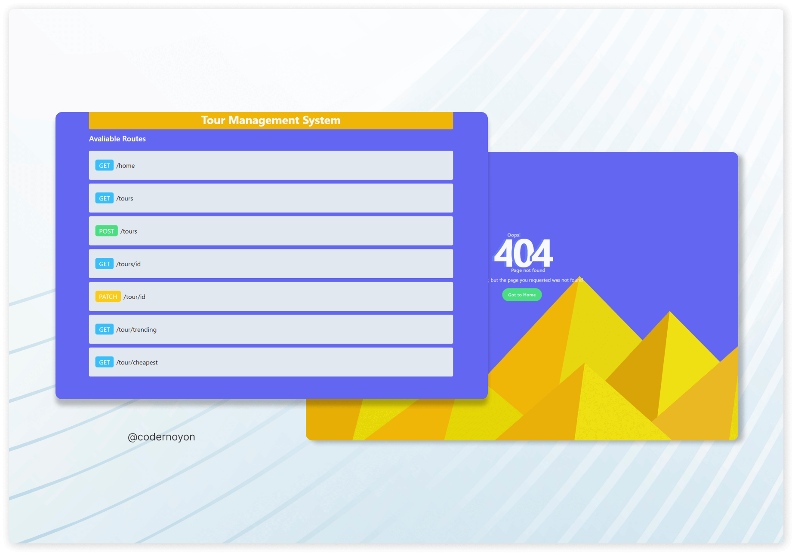

# Tour Management System

## The api is hosted on Render, to get the api  [**`Click here`**](https://tourmanagement-system.onrender.com/)

Make sure to test the API with Postman or any other REST client. (Recommended to use Postman)

---




```
   1. Get a all Tours: GET /tours
   2. Creat a Tour: POST /tours/
   3. Get a single Tour: GET /tours/:id
   4. Update a user: PATCH /tour/:id
   5. Get Top 3 Trending Tours: GET /tour/trending
   6. Get Top 3 Cheapest Tours: GET /tour/cheapest
```

Create a Tour JSON Data Example:

```
{
"name": "Moldives",
"image": "https://idsb.tmgrup.com.tr/ly/uploads/images/2021/09/24/146502.jpg",
"description": "While the Maldives is usually considered ‘the trip of a lifetime’ that comes with a hefty price tag, the increasing number of resorts across the island country offers something for all budgets and tastes",
"price": 250,
"destinations": ["Moldives ", "Boat Journey"],
"transPortation": "airbus",
"tourPackageType": "Travel and Adventure",
"meals": ["Complementary food"],
"availableSeat": 55,
"status": "unavailable"

}
```


## Technologies used in this project

- NodeJS
- ExpressJS
- Cors
- Mongoose
- Dotenv
- Colors (For colorful console)
- Nodemon (For developmnet purpose)


## Connect with me

<div align="center">
<a href="https://twitter.com/codernoyon" target="_blank">

</a>
<a href="https://dev.to/codernoyon" target="_blank">

</a>
<a href="https://linkedin.com/in/codernoyon" target="_blank">

</a>
<a href="https://www.facebook.com/codernoyon" target="_blank">

</a>
<a href="https://instagram.com/codernoyon" target="_blank">

</a>
<a href="https://github.com/codernoyon" target="_blank">

</a>
<a href="https://codepen.com/codernoyon" target="_blank">

</a>
<a href="https://stackoverflow.com/users/17615131/codernoyon" target="_blank">

</a>
<a href="https://dribbble.com/codernoyon" target="_blank">

</a>
<a href="https://www.behance.net/codernoyon" target="_blank">

</a>
<a href="https://www.youtube.com/c/codernoyon" target="_blank">

</a>  
</div>
